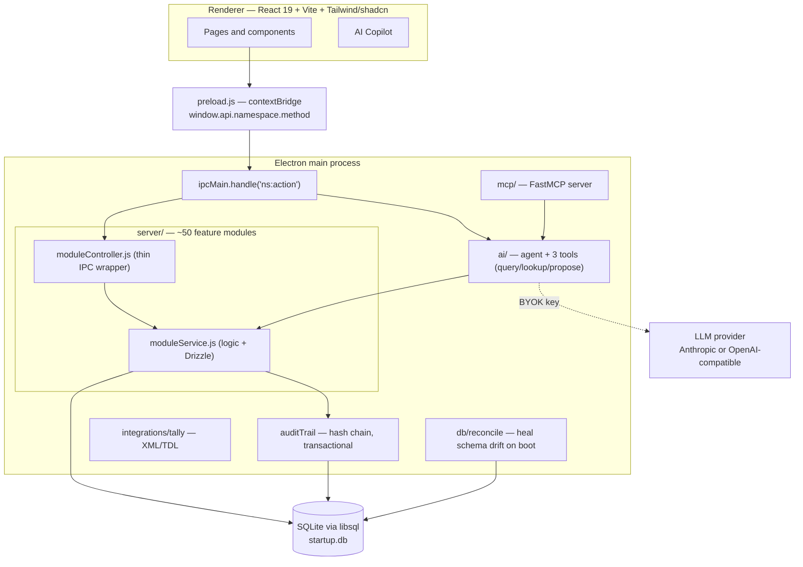

# MVP — TallyPrime Clone

Full-featured desktop ERP for Indian businesses. Accounting · Inventory · Payroll · Statutory compliance — all offline, all in one app.

---

## Stack

| Layer | Tech |
|---|---|
| Shell | Electron (desktop, offline-first) |
| Frontend | React 19 + TypeScript + Tailwind CSS v4 |
| Database | SQLite via Drizzle ORM (`startup.db`) |
| IPC | `preload.js` contextBridge (~270 channels) |
| AI | Anthropic Claude / any OpenAI-compatible LLM (BYOK) |

---

## Quick start

```bash
npm i         # installs root + client deps
npm start     # Vite dev server + Electron; live API docs at http://localhost:5180/docs
```

Database **auto-migrates on launch** — no manual steps, no data loss. On every boot, `initDB()` creates any new tables and adds any missing columns. To repair without launching:

```bash
npm run db:repair    # auto-detects userData startup.db (or pass STARTUP_DB_PATH=/path)
```

---

## Module Map

```
Gateway
├── Accounts
│   ├── Masters  →  Ledger · Group · Currency · Cost Centre · Cost Category · Budget · Scenario
│   ├── Vouchers →  Sales · Purchase · Journal · Contra · Receipt · Payment · Credit Note · Debit Note
│   └── Reports  →  Trial Balance · P&L · Balance Sheet · Ledger · Cash Book · Day Book · …
├── Inventory
│   ├── Masters  →  Stock Item · Stock Group · Stock Category · Unit · Godown · Price List
│   ├── Vouchers →  Material In/Out · Stock Journal · Physical Stock · Mfg Journal · Delivery/Receipt Note · …
│   └── Reports  →  Stock Summary · Ageing · Movement Analysis · Batch Register · …
├── Payroll
│   ├── Masters  →  Employee · Pay Head · Salary Structure · Attendance Type
│   ├── Vouchers →  Payroll Voucher · Attendance Voucher
│   └── Reports  →  Payslip · Salary Register · Attendance · PF · ESI · PT
└── Statutory
    ├── GST  →  GSTR-1 · GSTR-2A/2B · GSTR-3B · E-Invoice (IRN) · Reconciliation
    ├── TDS  →  Nature of Payment · Computation · Form 26Q
    ├── TCS  →  Nature of Goods · Computation · Form 27EQ
    └── Legacy  →  Excise · Service Tax · VAT
```

---

## Company Management

- Create multiple companies; switch active company from Gateway.
- Each company has its own **financial years** — create, switch, or close a year.
- **Feature flags** per company — enable/disable modules (Inventory, Payroll, GST, etc.).
- Password protection per company.
- Schema auto-migrates on launch; `app_meta` table tracks DB version.

---

## Chart of Accounts

**Groups** — unlimited-depth hierarchy (e.g. Current Assets → Bank Accounts). Tree-view navigation.  
**Ledgers** — leaf nodes; carry opening balance, credit limit, currency, parent group.  
**Cost Centres** — parallel hierarchy for cost allocation (e.g. Sales → North Zone).  
**Cost Categories** — classify cost centres (Revenue / Capital).  
**Currencies** — multi-currency; set default; transactions tag their currency.

---

## 19 Voucher Types

### Financial Vouchers

| Voucher | Purpose |
|---|---|
| Sales | Revenue from customers; updates debtor + revenue ledgers |
| Purchase | Expense from vendors; updates creditor + expense ledgers |
| Journal | General double-entry entries |
| Contra | Cash ↔ Bank transfers |
| Receipt | Cash/bank inflow from debtors |
| Payment | Cash/bank outflow to creditors |
| Credit Note | Sales returns; reduces revenue |
| Debit Note | Purchase returns; reduces expense |

### Inventory Vouchers

| Voucher | Purpose |
|---|---|
| Material In | Goods into godown without purchase invoice |
| Material Out | Goods out of godown without sale invoice |
| Stock Journal | Internal movement / write-off / transfer between godowns |
| Physical Stock | Adjust stock to actual counted quantity |
| Delivery Note | Goods dispatched before invoice is raised |
| Receipt Note | Goods received before bill is raised |
| Rejection In | Returned goods received back from customer |
| Rejection Out | Goods sent back to supplier |
| Manufacturing Journal | BOM consumption → finished goods produced |

### Payroll Vouchers

| Voucher | Purpose |
|---|---|
| Payroll | Salary disbursement; debits pay heads, credits cash/bank |
| Attendance | Daily attendance record per employee |

**All vouchers share:**
- Sequential auto-numbering with custom format per voucher type.
- Double-entry enforcement — saves only when Dr = Cr.
- Narration, date, reference number fields.
- Batch / lot allocation on inventory lines.
- Edit log — full field-level before/after diff on every save.
- Drill from any report line directly into voucher alteration.

---

## Inventory Management

### Stock Masters

**Stock Item** — opening balance per godown, reorder level, HSN/SAC code, valuation method (FIFO / Weighted Avg / LIFO / Std Cost), batch tracking toggle.  
**Godown** — hierarchical storage locations; stock tracked per item per godown.  
**Units** — simple (Kg, Pcs) or compound (Box of 12 → Pcs).  
**Stock Groups / Categories** — two independent classification hierarchies.

### Batch / Lot Tracking

Every stock item can be batch-tracked (opt-in). A batch carries: batch number, mfg date, expiry date. Voucher lines allocate quantity to specific batches. The **Batch Vouchers** report shows full lifecycle of any batch.

### Price Lists

**Price Levels** — tiers (Retail, Wholesale, Distributor, …).  
**Price Lists** — set selling price per item / group / category with quantity slabs. Applied automatically when a price level is selected on a sales voucher.

---

## Payroll & HR

### Employee Hierarchy

Employee → Employee Group → Employee Category (three levels). Each employee carries joining date, PAN, bank account, PF number, ESI number.

### Pay Heads

Salary components: Basic, HRA, DA, Conveyance, Bonus, Employer PF, PT, Deductions, etc.  
Computation modes: fixed amount · formula (e.g. `40% of Basic`) · slab-based (by age / service years / grade).  
Gratuity slabs configurable per service year band.  
Opening balance with Dr/Cr selector per pay head.

### Salary Structure

Assign pay heads + amounts/formulas to employees in bulk. Per-employee overrides supported.

### Attendance

Attendance Types: Present / Absent / Leave / Holiday / etc.  
Daily attendance register per employee.  
Payroll computation reads attendance to pro-rate salary automatically.

---

## Statutory & Compliance

### GST

- Multiple GSTIN registrations per company (one per state).
- HSN/SAC master with rate mapping (5% / 12% / 18% / 28%).
- GST auto-applied on vouchers based on HSN code.
- **GSTR-1** — outward supplies, B2B / B2C breakup, amendments.
- **GSTR-2A / 2B** — inward supplies; reconcile with purchase register.
- **GSTR-3B** — monthly summary; variance check against GSTR-1.
- **Challan Reconciliation** — match GST payments to returns.
- **E-Invoice (IRN)** — generate / cancel IRN; QR code; ack number stored per invoice; GSTIN validation.
- **IMS Inward Supplies** — track imported supplier invoices.

### TDS

- Nature of Payment master (Rent, Interest, Commission, Salary, …) with threshold and rate.
- TDS auto-deducted on applicable payment / journal vouchers.
- **TDS Computation** — liability summary by nature of payment.
- **TDS Payable Register** — amounts pending deposit to government.
- **Form 26Q** — quarterly TDS return data export.

### TCS

- Nature of Goods master (notified goods under Section 206C).
- TCS auto-collected on applicable sales vouchers.
- **TCS Computation** and **Payable Register**.
- **Form 27EQ** — quarterly TCS return data export.

### Legacy Taxes

**Excise** — duty classification, excise books, CENVAT credit tracking, PLA balance, dealer excise opening stock voucher.  
**Service Tax** — registration details, service tax computation.  
**VAT** — state-wise registration, VAT opening balance.

---

## Reports (585+ variants)

### Financial Statements

| Report | What you see |
|---|---|
| Trial Balance | All ledgers — opening, Dr total, Cr total, closing |
| Balance Sheet | Assets · Liabilities · Equity in hierarchical drill-down |
| Profit & Loss | Revenue → Gross Profit → Operating Profit → Net Profit |
| Cash Flow | Operating / Investing / Financing cash movements |
| Funds Flow | Changes in working capital (sources and uses) |
| Ratio Analysis | Liquidity · Profitability · Solvency ratios auto-calculated |

### Accounting Reports

Day Book · Ledger · Ledger Monthly Summary · Group Summary · Cash Book · Bank Book · Sales Register · Purchase Register · Journal Register · Credit Note Register · Debit Note Register · Bills Receivable · Bills Payable · Outstanding Receivable (with ageing buckets) · Outstanding Payable (with ageing buckets) · Overdue Receivables · Overdue Payables · Interest Receivable · Interest Payable · Cost Centre Summary · Cost Category Summary · Budget vs Actual (variance).

### Inventory Reports

Stock Summary · Stock Item Monthly Summary (period rows + bar chart) · Stock Group Report · Stock Category Report · Godown Report · Physical Stock Register · Stock Journal Register · Batch Vouchers · Stock Query · Reorder Status · Stock Ageing Analysis · Movement Analysis · Group/Category/Item Analysis · Transfer Analysis · Item Cost Analysis · Cost Estimation · Order Outstanding · Sales Order Book · Purchase Order Book.

**Drill chain:** Stock Item Monthly Summary → Stock Item Vouchers → Accounting Voucher Alteration.

### Job Work / Manufacturing

Job Work Orders · Job Work Stock (components in job work) · Job Work Variance (WIP) · Job Work Ageing · Job Work Annex · Job Work Analysis.

### Payroll Reports

Payslip (per employee) · Multi Pay Slip (all employees) · Salary Statement · Salary Register · Attendance Report · Pay Head Breakup · PF Reports · ESI Reports · Professional Tax.

### GST Reports

GSTR-1 · GSTR-1 Reconciliation · GSTR-2A/2B Reconciliation · GSTR-3B Annual Computation · IMS Inward Supplies · Challan Reconciliation · Track GST Return Activities.

### TDS / TCS Reports

TDS Computation · TCS Computation · TDS Payable Register · TCS Payable Register · Form 26Q · Form 27EQ.

### Exception & Audit

Negative Stock · Negative Ledger · Pending Documents · Edit Log Summary · Analysis & Verification.

### Statistics

Voucher Register Statistics (by voucher type × month) · Voucher Daily Summary.

**All reports support:** date range filter, ledger/group/category selection, drill-down, save/load custom views.

---

## Audit Trail

Every voucher save writes a tamper-evident log entry:

- Field-level before/after diff — exactly what changed, not just "edited".
- Hash chain — each entry links to the previous; silent edits break the chain.
- Transactional — log write and voucher write succeed or fail together.
- **Edit Log Summary** report shows all changes across the company in one view.

Compliant with Rule 11g (IT audit trail) requirements.

---

## AI Copilot

- Powered by **Anthropic Claude** or any OpenAI-compatible endpoint (DeepSeek, etc.).
- **BYOK** — bring your own API key; stored in main process only, never sent to renderer.
- Natural language queries over live accounting data.
- Three tools: `query` (run Drizzle query), `lookup` (search masters), `propose` (draft a document).
- Query suggestions, lookup helpers, document proposal generation.
- Also available as a **FastMCP server** for Claude Desktop / Cursor (`npm run mcp`).

---

## Integrations

### E-Invoice (IRN)
Generate and cancel GST e-invoices. Stores IRN, QR code, acknowledgement number, and e-invoice JSON per sales voucher.

### WhatsApp
Send invoices, payment reminders, and account statements to customers via WhatsApp API. Webhook support for two-way messaging. Message log with status tracking per contact.

### Tally Import
Import masters and vouchers from TallyPrime via XML/TDL export. Preview before import. Supports Chart of Accounts and historical vouchers.

### Banking
Bank reconciliation — match bank statement entries against ledger entries. Cheque management and payment tracking.

---

## Architecture



### IPC Contract — 3 files must stay in sync

Every backend operation is an IPC channel named `namespace:action`. Adding one requires changes in three places:

```
preload.js              →  window.api.ns.method (renderer contract)
server/index.js         →  ipcMain.handle('ns:action')
docs/api/modules/ns.yaml →  OpenAPI operation fragment
```

`npm run docs:check` (CI gate) fails if a registered channel has no OpenAPI fragment.

---

## Directory Structure

```
.
├── main.js / preload.js          # Electron main + IPC bridge
├── server/                       # backend (CommonJS), one folder per feature
│   ├── index.js                  # registers all ipcMain channels (~270)
│   ├── db/                       # Drizzle setup, schema/, migrations/, reconcile.js
│   │   └── schema/{sqlite,pg}/   # dual-dialect table definitions
│   ├── <feature>/                # company, ledger, voucher, gst, payroll, banking, report, …
│   │   ├── <feature>.js          #   init(db) — CREATE TABLE
│   │   ├── <feature>Service.js   #   business logic + Drizzle queries
│   │   └── <feature>Controller.js#   thin IPC wrapper
│   ├── ai/                       # copilot: keyStore, agent, 3 tools, aiController
│   ├── mcp/                      # FastMCP server (same tools, for Claude Desktop/Cursor)
│   ├── auditTrail/               # tamper-evident, transactional edit log
│   ├── integrations/tally/       # XML/TDL import connector
│   ├── docs/                     # OpenAPI generator + dev Scalar server (:5180)
│   └── tests/                    # Jest backend suite
├── client/                       # React 19 + Vite + TS + Tailwind v4
│   └── src/
│       ├── pages/                # routed screens (master, transactions, reports, utilities)
│       ├── components/shadcn/    # shadcn/ui primitives
│       ├── components/blocks/    # reusable composites (StatCard, DataTableCard, …)
│       ├── components/ui/        # custom components (FullScreenPanel, DataTable, …)
│       └── types/api/            # window.api TypeScript contracts
└── docs/                         # openapi.yaml, DB docs, CONTRIBUTING, ROADMAP
```

---

## Commands

| Command | Purpose |
|---|---|
| `npm start` | Run the app (live API docs at `:5180/docs`) |
| `npm test` | Backend Jest suite |
| `npm run docs:gen` | Regenerate OpenAPI spec |
| `npm run docs:check` | CI gate — fail if channel has no OpenAPI fragment |
| `npm run db:generate` | Regenerate Drizzle migrations |
| `npm run db:parity` | CI gate — fail if pg↔sqlite schema diverges |
| `npm run db:repair` | Heal schema drift without launching the app |
| `npm run mcp` | Run FastMCP server (`STARTUP_DB_PATH=…`) |
| `cd client && npm run build` | Type-check + build the renderer |

---

## Further Reading

- [`HASAN-FEATURE.md`](HASAN-FEATURE.md) — full feature guide + onboarding
- [`docs/CONTRIBUTING.md`](docs/CONTRIBUTING.md) — how to add channels / change schema / UI rules
- [`docs/ROADMAP-tally-parity.md`](docs/ROADMAP-tally-parity.md) — Tally feature-parity roadmap
- `docs/api/openapi.yaml` — full API spec (renders in Swagger UI / Scalar / Redoc)
