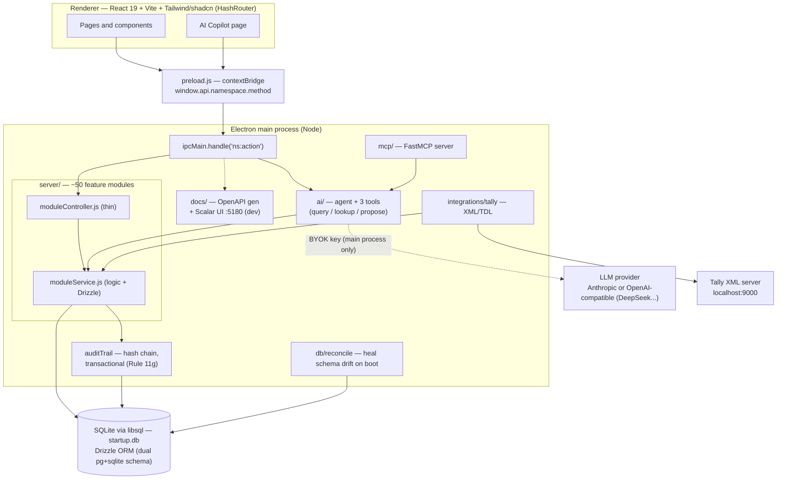
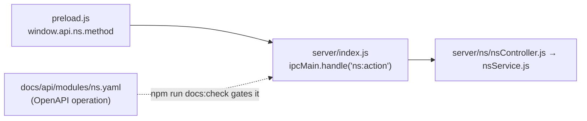

# MVP — AI-native accounting ERP ("Cursor for Tally")

A Tally-style desktop accounting/ERP (Electron + React + SQLite) with an **AI copilot**, an
**auto-generated API**, a **Drizzle dual-DB** layer, a **tamper-evident audit trail**, and a
**Tally import** connector. Branch `hasan-feature` is the active line — see
[`HASAN-FEATURE.md`](HASAN-FEATURE.md) for the full feature guide and
[`docs/CONTRIBUTING.md`](docs/CONTRIBUTING.md) for the contribution rules.

## Quick start

```bash
npm i                  # root: Electron + backend deps
npm i --prefix client  # client deps (REQUIRED)
npm start              # Vite dev server + Electron; live API docs at http://localhost:5180/docs
```

## Architecture



### The IPC contract (keep 3 places in sync)

Every backend operation is an Electron IPC channel named `namespace:action`. To add/change one:



`npm run docs:check` (CI gate) fails the build if a registered channel has no OpenAPI fragment.

## Directory structure

```
.
├── main.js / preload.js          # Electron main process + IPC bridge
├── server/                       # backend (CommonJS), one folder per feature
│   ├── index.js                  # registers all ipcMain channels (~270)
│   ├── db/                       # libsql/Drizzle setup, schema/, migrations/, reconcile.js
│   │   └── schema/{sqlite,pg}/   # dual-dialect Drizzle table definitions
│   ├── <feature>/                # company, ledger, voucher, gst, payroll, banking, report, ...
│   │   ├── <feature>.js          #   init(db) — CREATE TABLE
│   │   ├── <feature>Service.js   #   business logic + Drizzle queries
│   │   └── <feature>Controller.js#   thin IPC wrapper
│   ├── ai/                       # copilot: keyStore (BYOK), agent, tools (3), aiController
│   ├── mcp/                      # FastMCP server (same tools, for Claude Desktop/Cursor)
│   ├── auditTrail/               # tamper-evident, transactional edit log
│   ├── integrations/tally/       # XML/TDL import connector
│   ├── docs/                     # OpenAPI generator + dev-only Scalar server
│   └── tests/                    # Jest backend suite (the correctness oracle)
├── client/                       # React 19 + Vite + TS + Tailwind v4
│   └── src/
│       ├── pages/                # routed screens (master, transactions, reports, utilities...)
│       ├── components/shadcn/    # shadcn/ui primitives
│       ├── components/blocks/    # reusable composites (StatCard, DataTableCard, ...)
│       ├── components/ui/        # existing custom components
│       └── types/api/            # window.api TypeScript contracts
└── docs/                         # API (openapi.yaml), DB docs, CONTRIBUTING, ROADMAP
```

## Commands

| Command | Purpose |
|---|---|
| `npm start` | run the app (live API docs at `:5180/docs`) |
| `npm test` | backend Jest suite |
| `npm run docs:gen` / `docs:check` | regenerate / CI-gate the OpenAPI spec |
| `npm run db:generate` / `db:parity` | regenerate migrations / CI-gate pg↔sqlite parity |
| `npm run mcp` | run the MCP server (`STARTUP_DB_PATH=...`) |
| `cd client && npm run build` | type-check + build the renderer |

## Further reading

- [`HASAN-FEATURE.md`](HASAN-FEATURE.md) — full feature guide + onboarding
- [`docs/CONTRIBUTING.md`](docs/CONTRIBUTING.md) — how to add channels / change schema / UI rules
- [`docs/ROADMAP-tally-parity.md`](docs/ROADMAP-tally-parity.md) — Tally feature-parity roadmap
- `docs/api/openapi.yaml` — full API spec (renders in Swagger UI / Scalar / Redoc)

## Status of earlier suggestions

The original suggestions (TypeScript/ORM backend, a real ORM with shared query helpers, consolidated
schema) are largely addressed: **Drizzle ORM** now backs all services with **dual SQLite/Postgres
schemas**, modules are self-contained (`server/<feature>/{service,controller,init}`), and the schema
lives in one place per dialect. Remaining items (full TS backend, Koa/HTTP) are tracked in the roadmap.
