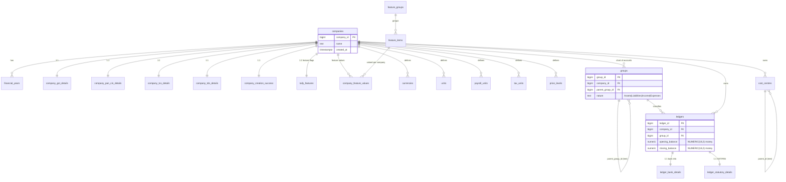
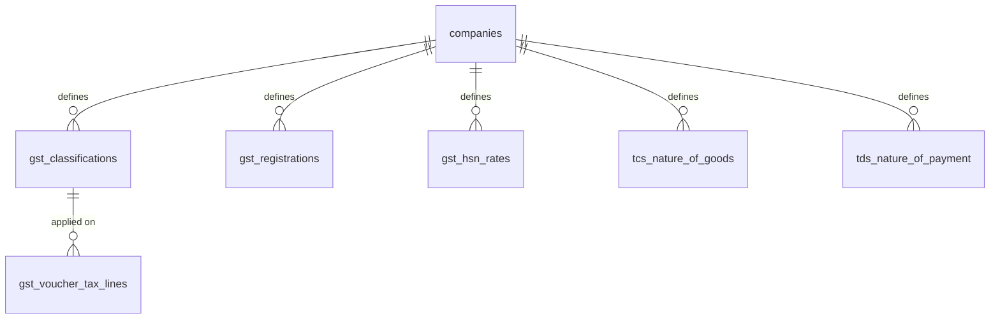
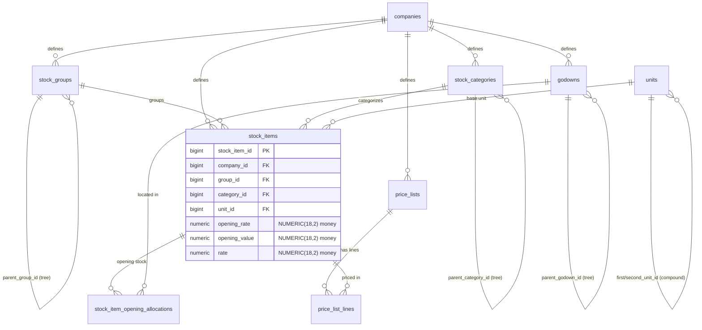
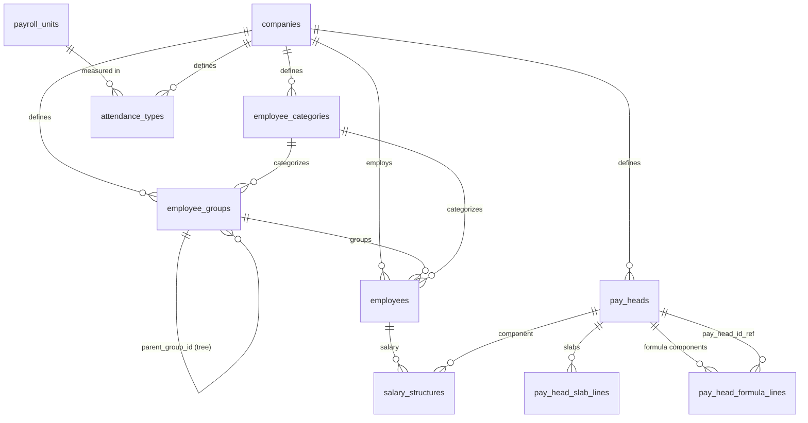
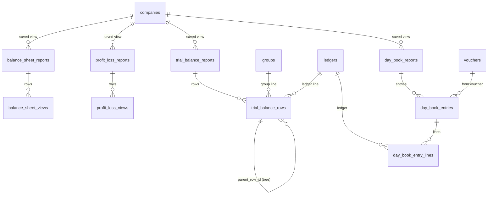

# Entity-Relationship Diagram

This ERD is derived from the assembled Postgres contract in
[`schema.postgres.sql`](./schema.postgres.sql), which is itself generated from
the per-module DDL in [`modules/`](./modules/). The source of truth is the live
SQLite schema created by each backend module's `init(db)` function under
`server/<module>/<module>.js`.

**Scale:** 79 tables, 136 foreign keys (all emitted as `ALTER TABLE ... ADD
CONSTRAINT` in section 2 of the schema). To stay legible, the diagram below
shows the **key entities and the relationships that define the data model**
(tenant fan-out, the accounting/inventory/payroll masters, and the voucher
transaction tree). It does **not** draw every column — see the schema file and
the per-module `*.md` docs for full column lists.

## Conventions

- `companies` is the tenant root. **Almost every table** carries a
  `company_id` FK back to `companies` (`ON DELETE CASCADE`). To avoid a hairball,
  those edges are summarized rather than drawn individually for every leaf table.
- `||--o{` = one-to-many (parent has many children).
- `||--||` = one-to-one (e.g. company-detail tables keyed by `company_id`).
- Self-references (`parent_id`, `parent_group_id`, etc.) model hierarchies/trees.

## Core + Masters

## Statutory (GST / TDS / TCS)

## Inventory

## Payroll

## Transactions (Voucher tree)

```mermaid
erDiagram
    companies ||--o{ voucher_types : "defines"
    voucher_types ||--o{ voucher_types : "parent_vt_id (tree)"
    voucher_types ||--|| voucher_type_configs : "1:1 config"
    companies ||--o{ voucher_entry_actions : "automation rules"

    companies ||--o{ vouchers : "books"
    financial_years ||--o{ vouchers : "in FY"
    ledgers ||--o{ vouchers : "party_ledger_id"
    vouchers ||--o{ voucher_entries : "dr/cr legs"
    ledgers ||--o{ voucher_entries : "posts to"
    vouchers ||--o{ voucher_stock_entries : "inventory legs"
    stock_items ||--o{ voucher_stock_entries : "item"
    units ||--o{ voucher_stock_entries : "qty unit"
    godowns ||--o{ voucher_stock_entries : "from/to godown"
    voucher_stock_entries ||--o{ voucher_batches : "batch alloc"
    vouchers ||--o{ voucher_batches : "batches"
    vouchers ||--o{ voucher_bill_references : "bill-wise"
    ledgers ||--o{ voucher_bill_references : "party"
    vouchers ||--o{ voucher_bank_details : "bank info"
    vouchers ||--o{ voucher_cost_centres : "cost allocation"
    voucher_entries ||--o{ voucher_cost_centres : "leg"
    cost_centres ||--o{ voucher_cost_centres : "allocated to"
    vouchers ||--o{ voucher_cash_denominations : "cash count"
    vouchers ||--o{ voucher_receipt_details : "receipt"
    vouchers ||--o{ voucher_party_details : "party snapshot"
    vouchers ||--o{ voucher_dispatch_details : "dispatch"
    vouchers ||--o{ voucher_credit_note_details : "credit note"
    vouchers ||--o{ voucher_debit_note_details : "debit note"
    vouchers ||--o{ voucher_payroll_entries : "payroll lines"
    employees ||--o{ voucher_payroll_entries : "for employee"
    pay_heads ||--o{ voucher_payroll_entries : "pay head"

    vouchers {
        bigint voucher_id PK
        bigint company_id FK
        bigint fy_id FK
        date   date
        boolean is_cancelled
    }
    voucher_entries {
        bigint entry_id PK
        bigint voucher_id FK
        bigint ledger_id FK
        text   type "Dr|Cr"
        numeric amount "NUMERIC(18,2) money"
    }
```

## GST lines, Attendance, Stock-take, Banking, Integrations

```mermaid
erDiagram
    vouchers ||--o{ gst_voucher_tax_lines : "tax lines"
    voucher_entries ||--o{ gst_voucher_tax_lines : "per leg"
    financial_years ||--o{ gstr1_exports : "return period"
    companies ||--o{ gstr1_exports : "files"

    companies ||--o{ attendance_vouchers : "records"
    attendance_vouchers ||--o{ attendance_voucher_entries : "lines"
    employees ||--o{ attendance_voucher_entries : "for employee"
    attendance_types ||--o{ attendance_voucher_entries : "of type"

    companies ||--o{ physical_stock_entries : "stock take"
    physical_stock_entries ||--o{ physical_stock_entry_lines : "lines"
    stock_items ||--o{ physical_stock_entry_lines : "item"
    godowns ||--o{ physical_stock_entry_lines : "location"

    voucher_entries ||--o{ reconciliations : "bank recon"
    vouchers ||--o{ reconciliations : "voucher"
    ledgers ||--o{ reconciliations : "bank ledger"

    companies ||--o{ einvoice_credentials : "e-invoice creds"
    companies ||--o{ einvoice_records : "e-invoice"
    vouchers ||--o{ einvoice_records : "for voucher"
    companies ||--o{ whatsapp_config : "config"
    companies ||--o{ whatsapp_templates : "templates"
    companies ||--o{ whatsapp_logs : "send log"
    vouchers ||--o{ whatsapp_logs : "about voucher"
```

## Reports (saved config + materialized rows)

> Report tables (`*_reports` headers and `*_views` / `*_rows` / `*_entries`
> bodies) are **materialized snapshots / saved configurations**, not live joins.
> The `report` and `master` modules own **no tables** — they read from the
> tables above. See [`modules/report.md`](./modules/report.md) and
> [`modules/master.md`](./modules/master.md).
